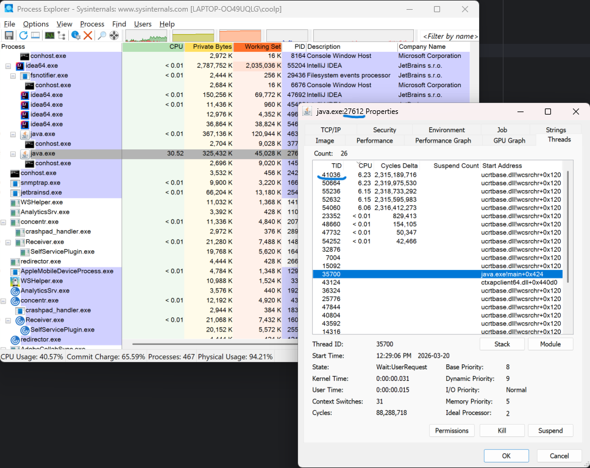
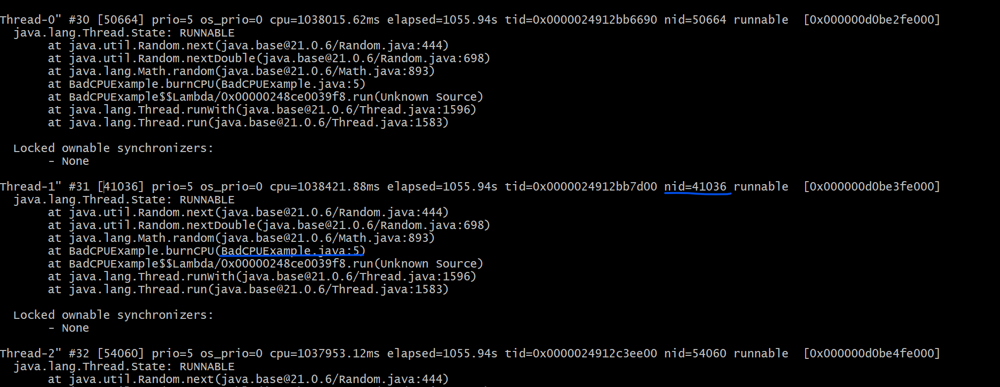
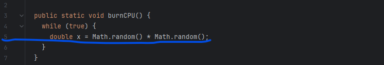

# CPU High Usage Detection

An example demonstrating how to detect and fix high CPU usage issues caused by multi-threaded Java applications.

## How to Use

### 1. Download MS Process Explore

Download Process Explorer from Microsoft: 
https://learn.microsoft.com/en-us/sysinternals/downloads/process-explorer

Windows Task Manager can show which process is using high CPU, but it cannot identify which specific thread is responsible. In a multi-threaded environment, you need the thread ID (NID) to diagnose the issue.

### 2. Run your Java application

Start your Java program using IntelliJ IDEA or from the command line.
This makes it easier to reproduce and observe abnormal CPU usage.

### 3. Use Process Explorer

Open Process Explorer and locate the process with high CPU usage.

<ul>
<li>Identify the PID of the process</li>

<li>Double-click the process</li>

<li>Go to the Threads tab to find the thread ID (TID) consuming high CPU</li>
</ul>

### 4, Analyze with jstack
Use jstack with the PID to identify the specific Java code causing the high CPU usage.
Match the thread ID (TID) from Process Explorer with the thread dump to pinpoint the problem.

1. Start jstack with PID (27612)
    - jstack -l 27612
   

2. Search NID (41036) from output

3. find the issue line

## Future Enhancements
<li>Add automated monitoring scripts

<li>Provide examples of common high-CPU patterns

<li>Include performance optimization techniques

## Contributing

Contributions are welcome! Feel free to open issues or submit pull requests.

## License

[MIT License](LICENSE)

---

Made with ❤️ for Spring Boot developers