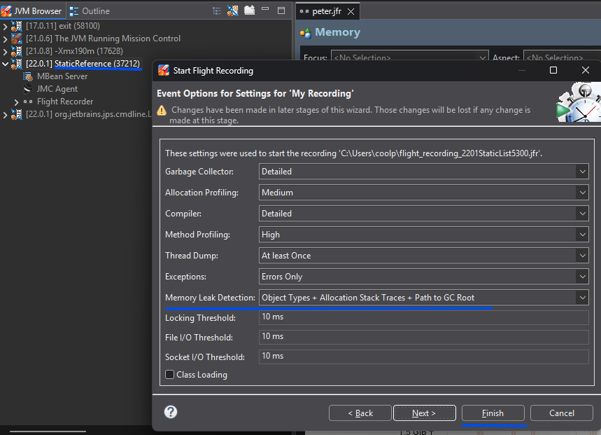
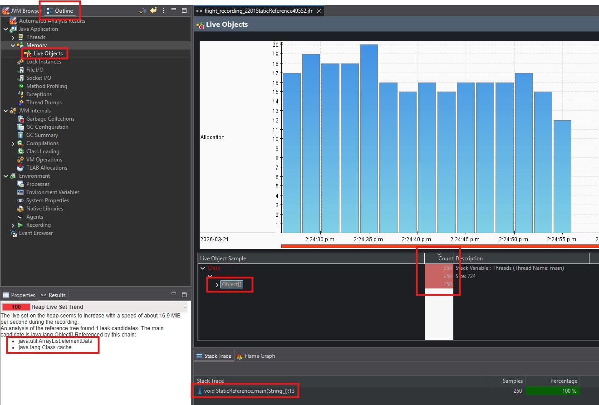
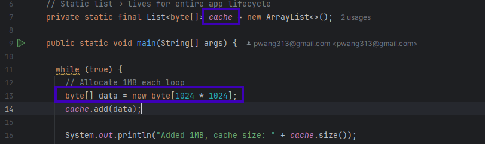

# Memory Leak Detection
Some examples demonstrating how to detect and memory leak issues caused by multithreaded Java applications.

## How to Use

### 1. Download JDK Mission Control (JMC) 

Download JDK Mission Control (JMC) latest version:<br>
https://www.oracle.com/java/technologies/javase/products-jmc9-downloads.html

### 2. Run your Java application

Start your Java program using IntelliJ IDEA or from the command line.
with the parameters.
```adlanguage
java -Dcom.sun.management.jmxremote \
 -Dcom.sun.management.jmxremote.port=9020 \
 -Dcom.sun.management.jmxremote.authenticate=false \
 -Dcom.sun.management.jmxremote.ssl=false \
 StaticReferenceWithMemoryLeak
```
### 3. Use JMC

Open JMC and locate the process with Java application name.

<ul>
<li>Identify the process by the application name</li>
<li>Right-click the process</li>
<li>Chose the <em>Start Flight Record ...</em></li>
<li>Go to the next page, and chose the correct <em>Memory Leak Detection:</em></li>
<li>click <em>Finish</em> to start record</li>
</ul>


### 4, Analyze with JMC
<br>


<li>After the recording is done, go to thw <em>Outline</em> tab</li>
<li>Chose <em>Memory->Live Objects</em></li>
<li>Pick the Top count, object may have issue</li>
<li>Find the specific object (cache) and line number (13) for the memory issue</li>

## Future Enhancements
<li>Unbounded Cache
<li>ThreadLocal Leak
<li>Listeners Not Removed
<li>Inner Classes Holding Outer Reference
<li>Unclosed Resources

## Contributing

Contributions are welcome! Feel free to open issues or submit pull requests.


---

Made with ❤️ for Spring Boot developers