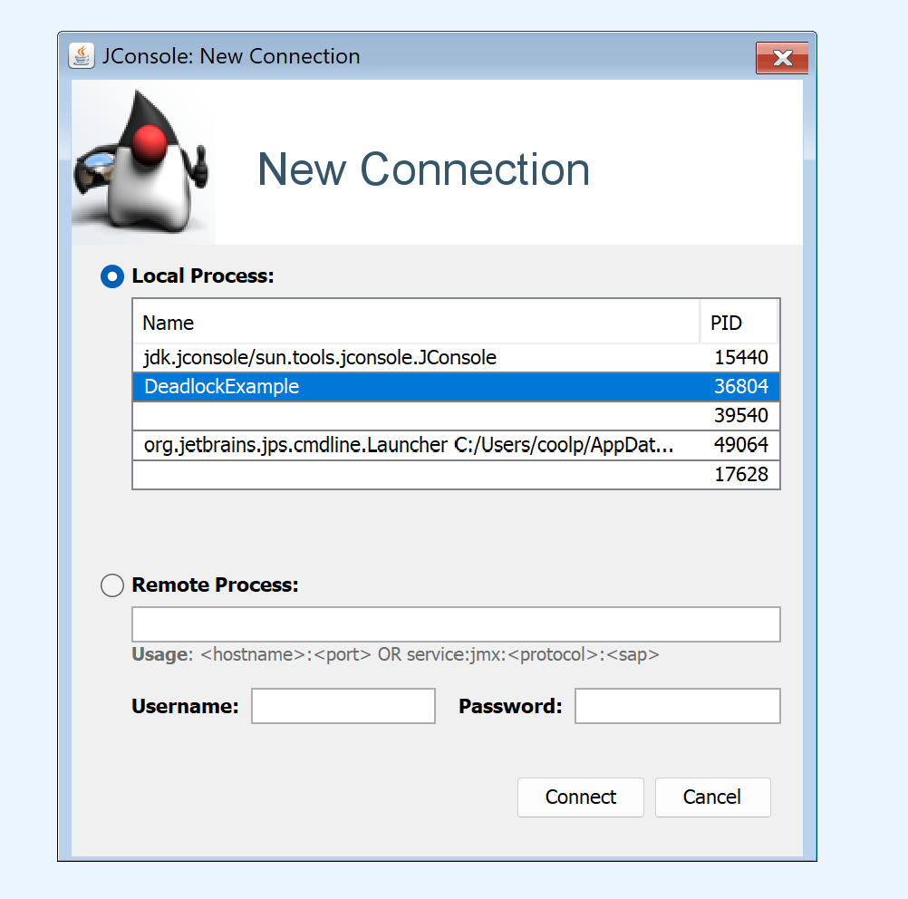
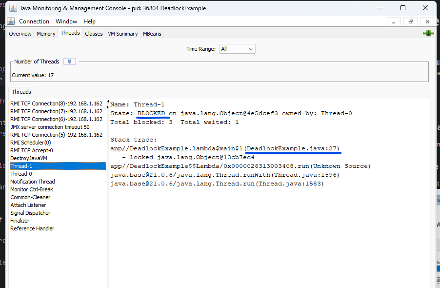
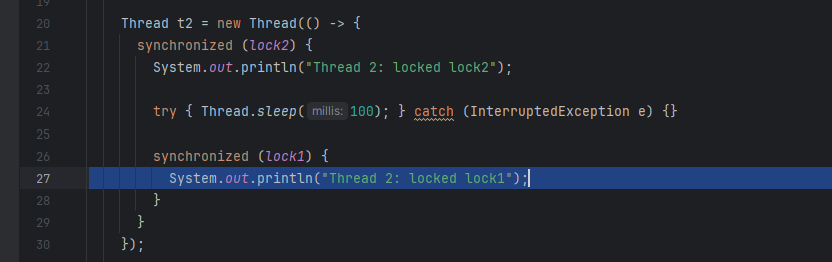
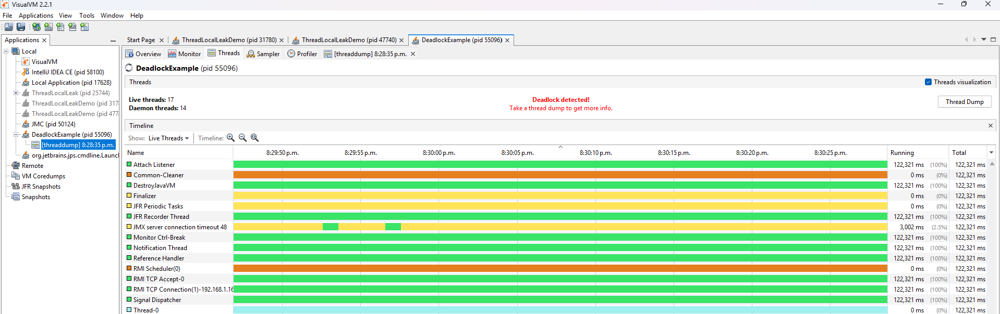
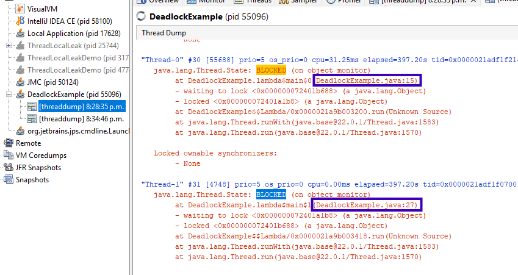

# Thread Dead Lock Detection

An example demonstrating how to detect thread dead lock caused by multi-threaded Java applications.

## How to Use

### 1. Run your java application
either from intellij or command line

### 2. Start JConsole from java bin folder

select the java you want to check

### 3. Find any deadlock thread by name, and check the java code 

java code

### 4. Alternate way to find deadlock
Run VisualVm and load Java application

Click `Threads` tab

Click `Thread Dump`

Search `BLOCKED`

## Contributing

Contributions are welcome! Feel free to open issues or submit pull requests.

---

Made with ❤️ for Spring Boot developers